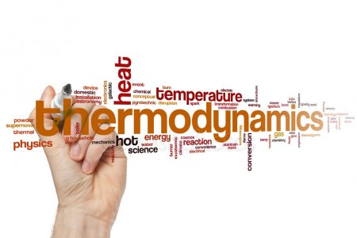

# Termodinámica
__UNLZ - FI__   
__Alumno:__ Daniel Antonio Lorenzo 

__Descripción:__ prácticas realizadas por mi durante el curso de termodinámica en la UNLZ - FI.   
Se ofrece libremente, sin garantía.

## índice

[Clase prática 1](https://nbviewer.jupyter.org/github/daniel-lorenzo/Termodinamica/blob/master/p01.ipynb)   
[Clase prática 2](https://nbviewer.jupyter.org/github/daniel-lorenzo/Termodinamica/blob/master/p02.ipynb)   
[Clase prática 3](https://nbviewer.jupyter.org/github/daniel-lorenzo/Termodinamica/blob/master/p03.ipynb)   
[Clase prática 4](https://nbviewer.jupyter.org/github/daniel-lorenzo/Termodinamica/blob/master/p04.ipynb)   
[Clase prática 5](https://nbviewer.jupyter.org/github/daniel-lorenzo/Termodinamica/blob/master/p05.ipynb)   
[Clase prática 6](https://nbviewer.jupyter.org/github/daniel-lorenzo/Termodinamica/blob/master/p06.ipynb)   
[Clase prática 7](https://nbviewer.jupyter.org/github/daniel-lorenzo/Termodinamica/blob/master/p07.ipynb)   
[Clase prática 8](https://nbviewer.jupyter.org/github/daniel-lorenzo/Termodinamica/blob/master/p08.ipynb)

## Modelos de parcial

[2do Parcial t2](https://nbviewer.jupyter.org/github/daniel-lorenzo/Termodinamica/blob/master/2doParcial2.ipynb)       

## Modelos de final

[Modelo 1 - clase teoría](https://nbviewer.jupyter.org/github/daniel-lorenzo/Termodinamica/blob/master/clase-e1.ipynb)     
[Modelo 2](https://nbviewer.jupyter.org/github/daniel-lorenzo/Termodinamica/blob/master/final2.ipynb)        
[Modelo 3](https://nbviewer.jupyter.org/github/daniel-lorenzo/Termodinamica/blob/master/final3.ipynb)       
[Modelo 4](https://nbviewer.jupyter.org/github/daniel-lorenzo/Termodinamica/blob/master/final4.ipynb)         

En construcción . . .

Teoría:

* [<<< Segundo Principio de la Termodinámica >>>](http://laplace.us.es/wiki/index.php/Segundo_Principio_de_la_Termodin%C3%A1mica)
* [<<< Entropía >>>](http://laplace.us.es/wiki/index.php/Entrop%C3%ADa)

Varios:

[Segundo Principio de la termodinámica](https://nbviewer.jupyter.org/github/daniel-lorenzo/Termodinamica/blob/master/2do_Principio.ipynb)    
[Cambio de entropía de gases ideales](https://nbviewer.jupyter.org/github/daniel-lorenzo/Termodinamica/blob/master/Cambio_entropia_gases.ipynb)   
[Exergía ejemplos](https://nbviewer.jupyter.org/github/daniel-lorenzo/Termodinamica/blob/master/exergia_ejemplos.ipynb)

En construcción . . .

### Bibliografía:  
Termodinamica, 7ma. Edicion - Yunes A. Cengel - Michael A. Boles - Ed. McGraw-Hill
